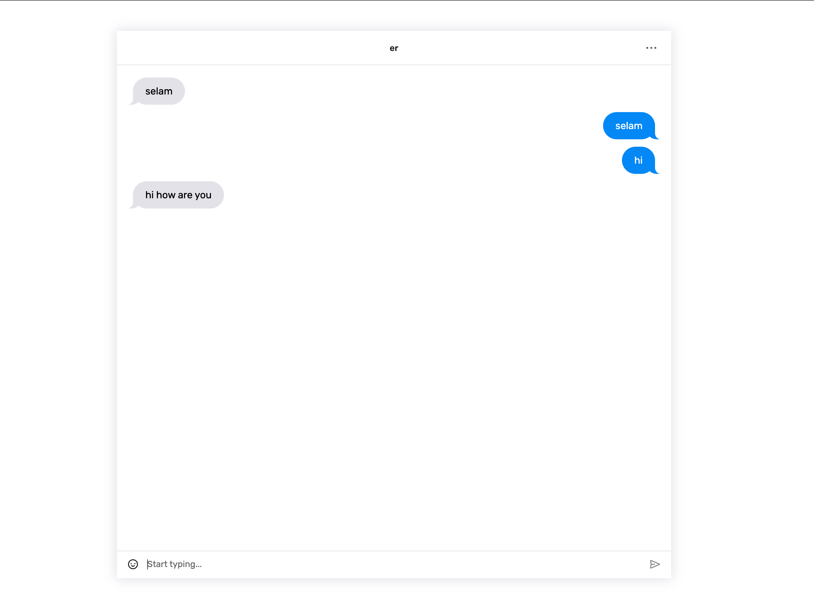

# Fullstack Chat App with Socket.io and React

## Screenshots

## Tech Stack

React, Typescript, styled-components, Express.js and Socket.io

### For Backend Repo
[Link](https://github.com/aniler0/localchatapp-be)

## Explanationn

Enter username and room name that you want to join or create, then wait for users to join into your room. And that's it :) Start chatting with your friends

## Try It

[Demo](https://localchatapp-fe.vercel.app/)

